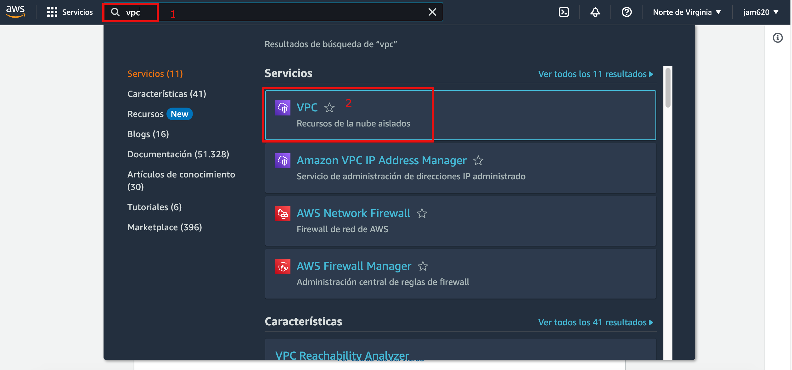
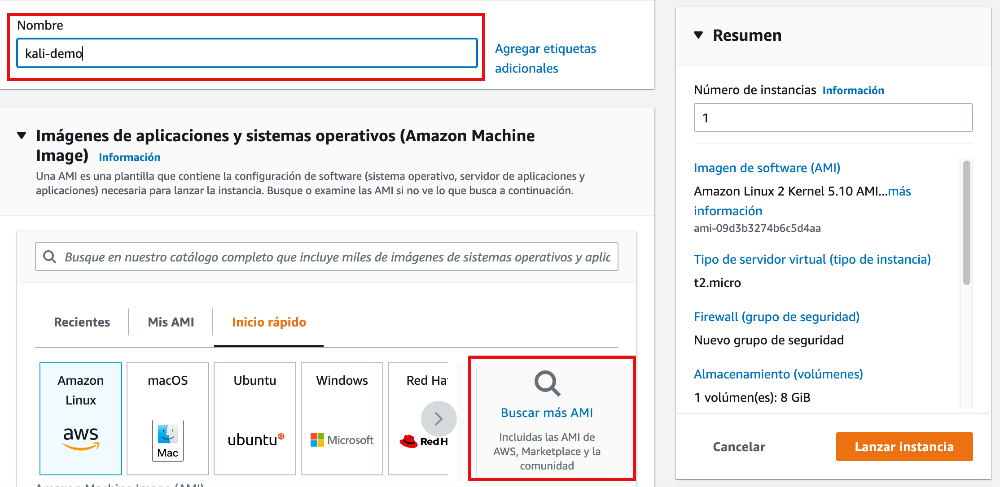
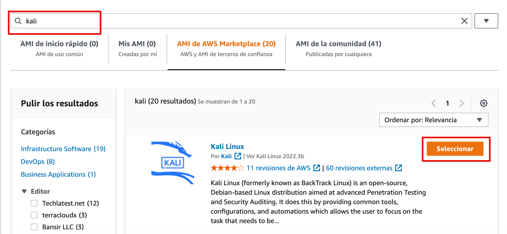
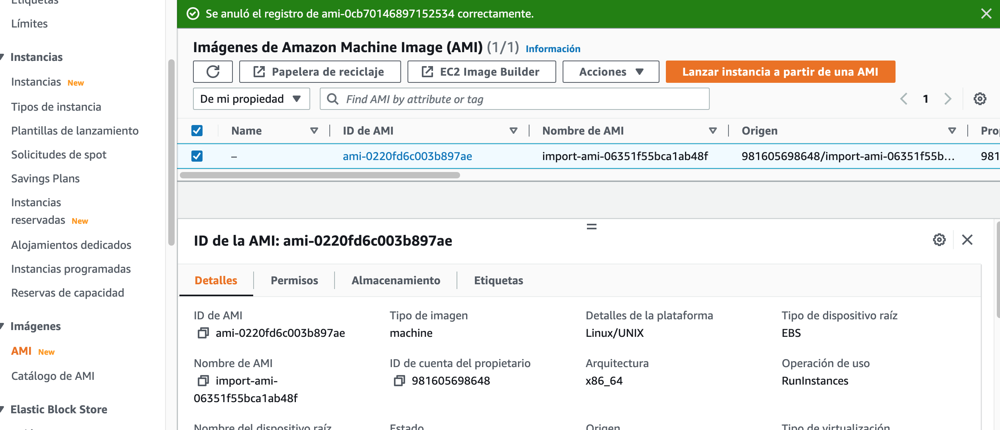

# Lab Vulnerable utilizando AWS


Durante nuestro viaje de aprendizaje en el área de ciberseguridad siempre se ha dificultado al inicio encontrar entornos de prueba vulnerables, no obstante gracias al esfuerzo de muchas personas podemos decir que ese punto ha ido mejorando, dentro de los lugares preferidos de aprendizaje para está área podemos mencionar https://tryhackme.com/, https://hackthebox.com/, https://rangeforce.com/, https://www.vulnhub.com/, etc. 

Aunque nada va reemplazar el hecho que uno despliegue su infraestructura en un hypervisor como Vmware, Virtualbox, hyperV o que repliquemos un ejercicio de cyber range con un Active Directory con workstation, sin embargo rápidamente se nos presenta la limitante los recursos de memoria, disco duro, procesador por ejemplo los recursos mínimos para un ejercicio de cyber range serían los siguiente:

- Memoria Ram 16GB disponible (4GB para DC, 4GB para dos workstations y el resto para SO)
- 60GB de almacenamiento como mino disponible

De igual manera podríamos implementar nuestro CTF con contenedores vulnerables, mi amigo y colega Elzer Pineda escribió un [articulo](https://backtrackacademy.com/articulo/como-crear-un-ctf-con-owasp-juice-shop-y-traefik) donde explica como hacerlo con docker y traefik.  

El objetivo de este articulo es demostrar la implementación de un hacking lab en AWS bastante similar a un home lab y utilizando una máquina virtual de [vulnhub](vulnhub.com). 

### Requisitos

1. Cuenta de AWS (no gratuita)
2. Una vm vulnerable de vulnhub usaremos la siguiente https://download.vulnhub.com/breach/Breach-1.0.zip
3. De igual manera debemos verificar que la Vm este dentro de los kernels permitidos https://docs.aws.amazon.com/vm-import/latest/userguide/prerequisites.html


1. #### Creación VPC

Vamos a proceder a crear una red virtual en donde incluiremos la máquina vulnerable y un Kali linux, buscamos en la barrita de búsqueda **vpc** y seleccionamos la opción de VPC señalada en la siguiente imagen



Ahora vamos a proceder a crear nuestra VPC, haciendo click en el botón naranja **Crear VPC**


Debemos realizar las siguiente modificaciones, en el nombre del proyecto y la red debe ser **192.168.110.0/24**, para este lab es asi dado que es la red usada en la vm de vulnhub.


En la zonas de disponibilidad solamente marcamos que sea una 


Procedemos a darle click a crear VPC


Mientras se crea debemos observar que todo lo que se está generando


Cunando este listo podemos ir a **ver VPC**


Esta lista nuestra vpc


2. #### Creación de Instancia EC2 con Kali 

Escribimos en nuestra barra de búsqueda Ec2


En el panel de Ec2 vamos a instancias y luego Lanzar instancias


Procedemos  a ponerle un nombre a la instancias y debemos ir a buscar la imagen de Kali en el martketplace



Buscamos la imagen correcta en este caso escribimos **Kali** en el buscador y vamos a seleccionar la imagen

 

Procedemos a darle click  a **continuar**


Si todo sale bien regresamos a la pantalla anterior y debe salir la imagen a utilizar


Procedemos a seleccionar el tipo de instancia y generar el par de llaves


Creamos el par de llaves


Debe quedarnos seleccionada la llave que acabos de crear y debemos guardarla en un ruta donde seamos los propietarios


En la sección de **Configuraciones de red**, vamos a editar y seleccionar la red que creamos anteriormente


Debe aparecernos la vpc que creamos


Habilitamos la asignación de IP pública, en esta sección podemos dejar las demás configuraciones como están, recordar revisar que tengamos una regla para acceder por ssh al Kali


Por último le damos 25GB de almacenamiento y ya podemos **Lanzar Instancia**


Probamos el acceso a la instancia, le damos permisos correspondientes a la llave y accedemos 

```shell
chmod 400 kalidemo
ssh -i kalidemo.pem kali@54.236.37.6
```


Verificación del acceso al Kali


3. #### Subida archivo OVA a AWS S3

   Primero debemos comprobar la región donde se encuentra la instancia, para esta demo se encuentra en **us-east-1**

   

   Vamos a crear un bucket de S3, por lo que buscamos en la barra s3 y damos click 

   

   Creamos un bucket

   

   

   Colocamos el nombre que deseamos y verificamos la región sea **us-east-1**

   

   Para temas de este laboratorio vamos a darles permiso público al bucket, desmarcamos la opción **Bloquear todo el acceso público**

   

   Aceptamos los términos y lo demos lo podemos dejar por defecto

   

   Clickeamnos **crear bucket**

   

Damos Click en el nombre del bucket


Vamos a cargar el ova que bajamos de vulnhub


Es importa antes de iniciar la carga del ova, verificar que nombre del archivo no tenga espacios


Por último comprobemos si los permisos fueron otorgados correctamente accedemos al bucket desde el navegador 


Una vez seleccionado el objeto debemos apuntar los **URI** lo usaremos más adelante y copiar la **URL del objeto**


Si les aparece algo como esto, debemos verificar los permisos


Vamos a cambiar el método de permisos de los bucket


Seleccionamos como aparece en la imagen


Regresamos a los permisos del objeto 


Vamos a editar la lista de control de acceso


Habilitamos la lectura pública, aceptamos los términos y guardamos. **Recordemos esto solamente lo hacemos de esta manera dado que es un lab, podemos restringir los permisos cuando ya hemos importado el ova**


Comprobamos el acceso al objeto


4. Subida del OVA

   Los siguientes pasos los vamos a realizar desde el cloud shell de aws, no importa el servicio donde estemos podemos darle click al icono de la terminal

   


Cerramos el mensaje


Se nos debe desplegar una terminal interactiva


Necesitamos crear tres archivos **containers.json** con la ruta del .ova, el archivo **trust-policy.json** para aguar la política de importación y por último el archivo **role-policy.json** con la política donde se encuentra la imagen.

Vamos a crear containers.json

`vi containers.json`

Va contener lo siguiente

```json
 [
{
"Description": "My Server OVA",
"Format": "ova",
"Url": "s3://my-import-bucket/vms/my-server-vm.ova"
}
]
```

Reemplazamos el url por la ruta del bucket de s3


Creamos el archivo trust-policy.json

`vi trust-policy.json`

Con el siguiente contenido

```json
{
"Version": "2012-10-17",
"Statement": [
{
"Effect": "Allow",
"Principal": { "Service": "vmie.amazonaws.com" },
"Action": "sts:AssumeRole",
"Condition": {
"StringEquals":{
"sts:Externalid": "vmimport"
}
}
}
]
}
```


Crearemos un role llamado vmimport y le damos acceso de importación y exportación.

` aws iam create-role --role-name vmimport --assume-role-policy-document "file://~/trust-policy.json"`

Si todo sale bien debemos ver lo siguiente


Creamos un archivo con la política de role-policy.json

`vi role-policy.json`

Con el siguiente contenido, reemplazamos donde dice **<your arn>** por el correspondiente del bucket

```json
{
"Version":"2012-10-17",
"Statement":[
{
"Effect": "Allow",
"Action": [
"s3:GetBucketLocation",
"s3:GetObject",
"s3:ListBucket"
],
"Resource": [
"<your arn>",
"<your arn>/*"
]
},
{
"Effect": "Allow",
"Action": [
"s3:GetBucketLocation",
"s3:GetObject",
"s3:ListBucket",
"s3:PutObject",
"s3:GetBucketAcl"
],
"Resource": [
"<your arn>",
"your arn/*"
]
},
{
"Effect": "Allow",
"Action": [
"ec2:ModifySnapshotAttribute",
"ec2:CopySnapshot",
"ec2:RegisterImage",
"ec2:Describe*"
],
"Resource": "*"
}
]
}
```


Utilice el siguiente comando **put-role-policy** para adjuntar la política al rol creado anteriormente. Asegúrese de especificar la ruta completa a la ubicación del archivo role-policy.json.

`aws iam put-role-policy --role-name vmimport --policy-name vmimport --policy-document "file://~/role-policy.json"`


Importamos la imagen

`aws ec2 import-image --description "Vulnerable Ova" --disk-containers "file://~/containers.json"`


Podremos verificar el estatus con el siguiente comando

`aws ec2 describe-import-image-tasks --import-task-ids import-ami-0b9aef01fc95f30d2`

Donde el **--import-task-ids** lo obtenemos del mensaje de arriba en este caso **"ImportTaskId": "import-ami-06351f55bca1ab48f"**


El estatus debe pasar a **completed**


5. Creación de la VM

   Vamos instancias EC2  y la sección de AMI y verificamos que en efecto se importo con el id **import-ami-06351f55bca1ab48f** y procedemos a lanzar una instancia

   

Al seleccionar lanzar la instancia desde la Ami, nos crea la misma a partir del OVA importada

De esta parte podemos dejar los datos por defecto a excepción **Configuraciones de red**, aquí procedemos a seleccionar el vpc que creamos inicialmente y bajamos el firewall de la instancia


Permitimos todo el tráfico y lanzamos la instancia


Verificamos las instancias estén en ejecución


Podemos acceder al ip publico de la instancia vulnerable y comenzar con nuestro pentest


6. Bibliografía

- *Required permissions for VM Import/Export - VM Import/Export*. (s. f.). https://docs.aws.amazon.com/vm-import/latest/userguide/required-permissions.html

